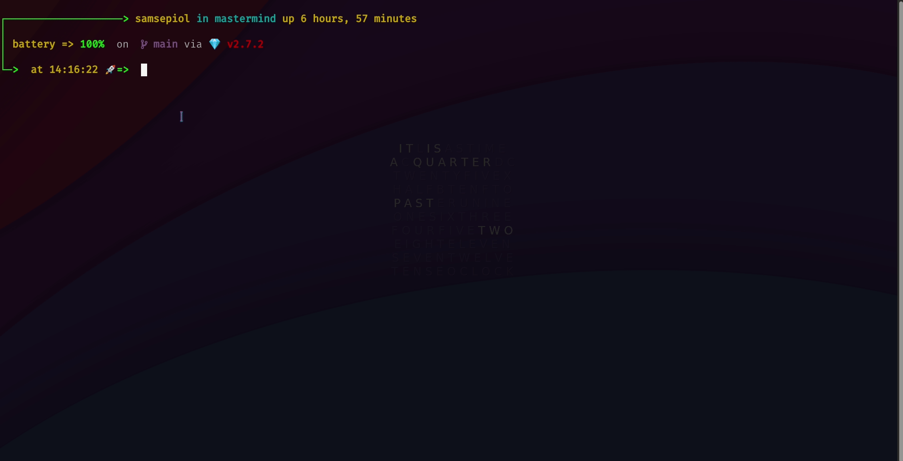

# [Mastermind](https://en.wikipedia.org/wiki/Mastermind_(board_game))
This project is part of the [The Odin Project](https://www.theodinproject.com/paths/full-stack-ruby-on-rails/courses/ruby-programming/lessons/mastermind)'s Ruby curriculum.

## Table of Contents
* [Description](#description)
* [Demo](#demo)
* [Built With](#built-with)
* [Algorithm](#algorithm)
* [Rules](#rules)
* [Play Online](#play-online)
* [Play Local](#play-local)
* [What I learned](#what-i-learned)

## Description
This implementation of the **Mastermind** game is a **User vs Computer** type of game played in the Terminal.
</br>
## Demo

</br>
## Built With
* Ruby
## Algorithm
Algorithm used for Computer Player's guessing is the **Swaszek** strategy. [Read more here](https://puzzling.stackexchange.com/a/8884)
## Rules
## Play Online
[repl.it](https://replit.com/@TheGeek2/mastermind)
## Play Local
```sh
git clone git@github.com:Maheshkumar-novice/Mastermind.git
```
```sh
cd Mastermind
```
```sh
ruby main.rb
```
## What I Learned
